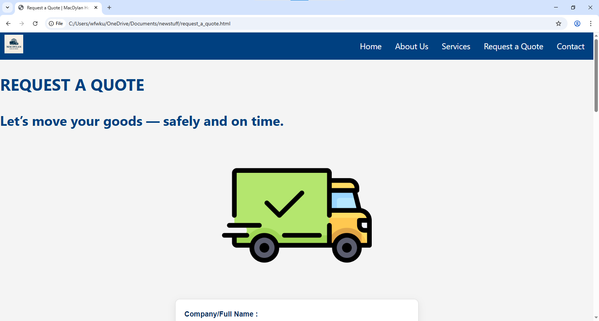

MacDylan Holdings Website

WEB DEVELOPMENT (WEDE5020w)
Andile Kundayi
ST10487104

Project Overview

MacDylan Holdings is a dynamic logistics and transport solutions company dedicated to providing reliable, efficient, and customer-focused services across South Africa and the wider region. Founded with a vision to bridge gaps in transportation and distribution, the company has steadily grown from a small local operator into a trusted name in the industry.

The project aims to establish a strong digital and corporate presence for MacDylan Holdings through the development of a professional website, company profile, and branding material. The website will serve as the primary communication platform for clients, partners, and stakeholders, showcasing the company’s history, services, mission, vision, and values (Chaffey, 2015).

This initiative is designed to:

Highlight the company’s identity by presenting a clear “Who We Are” section, backed by an authentic history and strong narrative.

Communicate core values and principles, including reliability, professionalism, and customer satisfaction.

Showcase services in transport, logistics, and related solutions, positioning MacDylan Holdings as a trusted partner in the industry.

Build credibility with well-structured content, professional imagery, and academic-style referencing where applicable (Kotler & Keller, 2016).

Enhance visibility and growth opportunities by creating a strong online footprint that supports client acquisition, tenders, and partnerships (Laudon & Traver, 2021).

Ultimately, this project provides MacDylan Holdings with the tools and presence required to compete in today’s digital-first business landscape, aligning the company’s operations with its long-term mission of delivering excellence in logistics.

Website Goals and Objectives
Primary Goals

Generate qualified leads by showcasing MacDylan Holdings’ services, reliability, and regional reach, converting website visitors into paying clients.

Increase website traffic and potential customer base.

Build brand credibility through a professional online presence.

Introduce a simple, user-friendly, and aesthetically pleasing interface (Garrett, 2011).

Specific Goals

Create a professional and trustworthy online presence.

Provide clients with clear and accessible information about services.

Showcase the company’s mission, vision, and values.

Enable smooth communication between the company and its clients.

Objectives

Design a responsive and user-friendly website.

Build a simple four-page structure (Homepage, About Us, Services, Quotation, Contact).

Use consistent branding, colour schemes, and typography.

Implement basic SEO and accessibility principles (Fishkin & Høgenhaven, 2013).

Proposed Website Features and Functionality
Homepage

Overview of the company and services.

About Us

Company history, mission, vision, and values.

Services

Logistics solutions, transport services, and future service offerings.

Request a Quotation

Interactive form where users can request service quotes.

Contact Page

Contact form, email, phone details, and physical address.

Timeline and Milestones

Week 1 – Planning and Research: Finalise objectives, features, and specifications.

Week 2 – Design: Select colour palette, typography, and create wireframes.

Week 3 – Development: Build website structure using HTML and apply CSS styling.

Week 4 – Interactivity: Add JavaScript for enhanced functionality.

Week 5 – Testing: Check loading speed, mobile responsiveness, and fix issues.

Week 6 – Launch: Connect domain, upload to hosting, and go live (Krug, 2014).

Part 1 Details

Part one will consist of the basic HTML code for the structure of the website. It will contain static content only, without styling or interactivity.

Site Map

The website will consist of five main pages:

Homepage

Introduction to MacDylan Holdings

Quick links to Services and Contact

About Us

Company history

Mission statement

Vision

Values

Services

Logistics solutions

Transport services

Additional offerings (future expansion)

Request a Quotation

Online quotation form

Contact

Contact form

Email and phone details

Physical address/location

References

Chaffey, D. (2015) Digital Business and E-Commerce Management. 6th edn. Harlow: Pearson Education.

Fishkin, R. and Høgenhaven, T. (2013) Inbound Marketing and SEO: Insights from the Moz Blog. New Jersey: Wiley.

Garrett, J.J. (2011) The Elements of User Experience: User-Centered Design for the Web and Beyond. 2nd edn. Berkeley: New Riders.

Kotler, P. and Keller, K. (2016) Marketing Management. 15th edn. Harlow: Pearson Education.

Krug, S. (2014) Don’t Make Me Think, Revisited: A Common Sense Approach to Web Usability. 3rd edn. Berkeley: New Riders.

Laudon, K.C. and Traver, C.G. (2021) E-commerce: Business, Technology, Society. 16th edn. Harlow: Pearson Education.

  PART 2
  

(Different browser screen sizes)

HOMEPAGE
  

ABOUT US

SERVICES

 
 

Request a Quote

  
 

 CONTACT
 
   
  

(Notible changes)

The service page , contact and the about page is different to how i had initailly presented it in the wireframe

Part 2 references

W3Schools, 2024. CSS Flexbox. [online] Available at: https://www.w3schools.com/css/css3_flexbox.asp
 [Accessed 19 September 2025].

W3Schools, 2024. CSS Media Queries. [online] Available at: https://www.w3schools.com/css/css3_mediaqueries_ex.asp
 [Accessed 19 September 2025].

W3Schools, 2024. CSS Colors – RGBA and HSLA. [online] Available at: https://www.w3schools.com/css/css_colors_rgb.asp
 [Accessed 19 September 2025].

W3Schools, 2024. CSS Navigation Bar. [online] Available at: https://www.w3schools.com/css/css_navbar.asp
 [Accessed 19 September 2025].

freeCodeCamp, 2024. Responsive Web Design Basics. [online] Available at: https://www.freecodecamp.org/news/what-is-responsive-web-design/
 [Accessed 19 September 2025].

freeCodeCamp, 2024. CSS Flexbox – A Complete Guide. [online] Available at: https://www.freecodecamp.org/news/css-flexbox-tutorial-with-cheatsheet/
 [Accessed 19 September 2025].

freeCodeCamp, 2024. CSS Color Values Explained. [online] Available at: https://www.freecodecamp.org/news/css-colors-rgb-hsl-hex/
 [Accessed 19 September 2025].
 
Part 3: Notable Changes 
1. Visual and User Interface Enhancements
1.1 Services Page

Several interface improvements were implemented on the Services page.
Firstly, interactive accordions were added using JavaScript and CSS to present information in a more organised and space-efficient manner. When a user clicks on a service category, the section expands to reveal detailed information.
Secondly, a search functionality was introduced to allow users to quickly filter services according to keywords, thereby improving navigation and accessibility.

1.2 Request a Quote Page

A “Go to Gallery” button was added to provide direct access to the Gallery page.
The Gallery itself was upgraded using a Lightbox system, enabling images to zoom slightly on hover and expand into a full-screen viewer when selected. Users can navigate through the gallery using image controls, creating a more interactive viewing experience.

1.3 Contact Page

The interactive map embedded within the Contact page was reduced in height to improve visual balance.
Additionally, the website colour palette was adjusted to incorporate more green tones, which enhances visual consistency and aligns better with the brand identity.

1.4 About Us Page

Accordions and modal components were added to the About Us page to increase interactivity. Smooth animations were also integrated to create a more dynamic user experience.

2. Functional and Technical Enhancements
2.1 JavaScript and DOM Manipulation

A number of JavaScript improvements were made across the website.
Form validation was implemented to ensure that users provide correct and complete information before submitting forms.
All forms were successfully connected to EmailJS, allowing them to send user input directly to an external email service.
Additional JavaScript features implemented across various pages include:

Accordions

Modals

Real-time search filtering

Lightbox gallery functionality

Improved event handling and interactive elements

DOM manipulation techniques were used throughout the site to create dynamic content and improve user engagement.

3. SEO Enhancements
3.1 On-Page SEO

Each page was updated with suitable meta descriptions, titles, and keywords to improve visibility on search engines. This includes page-specific metadata such as descriptions related to MacDylan Holdings.
Internal structure was improved through consistent use of semantic HTML and accessibility attributes.

3.2 Off-Page SEO

To demonstrate off-page optimisation, backlinks and placeholder social media links were included.
Even though the company currently does not operate social media accounts, these additions were made to illustrate capability and knowledge of off-page SEO techniques.

3.3 Technical SEO

Two important technical SEO files were added:

robots.txt, used to guide search engine crawlers on which pages to index or avoid.

sitemap.xml, which provides a complete map of the site’s structure for better indexing and search engine comprehension.

These additions improve the website’s overall discoverability and search engine performance.

4. Summary

The work completed resulted in substantial improvements to the website’s interface, functionality, and search engine optimisation.
Through the addition of interactive components, enhanced JavaScript logic, comprehensive SEO structures, and crawler guidance files, the website now demonstrates improved usability, technical depth, and professional quality.

References:

W3Schools. (2024). JavaScript Form Validation.

Available at: https://www.w3schools.com/js/js_validation.asp

(Accessed: 29 October 2025).

W3Schools. (2024). CSS Flexbox Tutorial.

Available at: https://www.w3schools.com/css/css3_flexbox.asp

(Accessed: 17 November 2025).

W3Schools. (2024). HTML Forms.

Available at: https://www.w3schools.com/html/html_forms.asp

(Accessed: 14 October 2025).

Mozilla Developer Network (MDN). (2024). Using the Fetch API.

Available at: https://developer.mozilla.org/en-US/docs/Web/API/Fetch_API/Using_Fetch

(Accessed: 22 September 2025).

Mozilla Developer Network (MDN). (2024). CSS Layout Techniques.

Available at: https://developer.mozilla.org/en-US/docs/Learn/CSS/CSS_layout

(Accessed: 7 November 2025).

Mozilla Developer Network (MDN). (2024). Accessible Rich Internet Applications (ARIA).

Available at: https://developer.mozilla.org/en-US/docs/Web/Accessibility/ARIA

(Accessed: 13 October 2025).

FreeCodeCamp. (2024). How to Build Responsive Web Pages.

Available at: https://www.freecodecamp.org/news/how-to-build-responsive-web-pages/

(Accessed: 4 November 2025).

FreeCodeCamp. (2024). JavaScript Event Listeners Explained.

Available at: https://www.freecodecamp.org/news/javascript-event-listeners/

(Accessed: 9 October 2025).

EmailJS Documentation. (2024). Sending Email from JavaScript.

Available at: https://www.emailjs.com/docs/

(Accessed: 2 November 2025).

EmailJS Documentation. (2024). Templates and Services.

Available at: https://www.emailjs.com/docs/examples/

(Accessed: 15 October 2025).

Google Developers. (2024). Search Engine Optimization (SEO) Starter Guide.

Available at: https://developers.google.com/search/docs/fundamentals/seo-starter-guide

(Accessed: 11 November 2025).

Google Developers. (2024). Sitemaps Overview.

Available at: https://developers.google.com/search/docs/crawling-indexing/sitemaps/overview

(Accessed: 28 October 2025).

Google Developers. (2024). Robots.txt Specifications.

Available at: https://developers.google.com/search/docs/crawling-indexing/robots/robots_txt

(Accessed: 23 September 2025).

CSS-Tricks. (2024). Creating Accessible Modals.

Available at: https://css-tricks.com/accessible-modals/

(Accessed: 31 October 2025).

CSS-Tricks. (2024). Crafting Accordions with HTML, CSS, and JavaScript.

Available at: https://css-tricks.com/how-to-create-an-accordion/

(Accessed: 16 November 2025).

Stack Overflow. (2024). Best Practices for Handling Form Submissions in JavaScript.

Available at: https://stackoverflow.com/questions/

(Accessed: 5 October 2025).

GeeksforGeeks. (2024). JavaScript DOM Manipulation Techniques.

Available at: https://www.geeksforgeeks.org/dom-document-object-model/

(Accessed: 12 November 2025).

TutorialsPoint. (2024). HTML5 Semantic Elements.

Available at: https://www.tutorialspoint.com/html5/html5_semantic_elements.htm

(Accessed: 27 October 2025).
 

 

 

